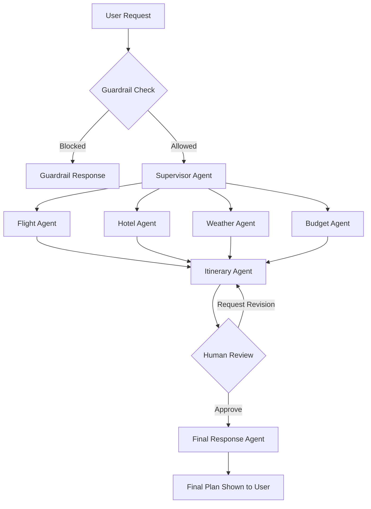

# TripMate AI — Multi-Agent Travel Planner

TripMate AI is a multi-agent travel-planning system built with **LangGraph** and **MCP** (Model Context Protocol). A Supervisor agent routes each request to the right specialists, an input Guardrail filters out invalid requests, and a Human-in-the-Loop (HITL) step lets you review and approve the draft itinerary before the final plan is generated. A FastAPI backend serves a web UI for the whole flow.

## Features

- **Supervisor-driven routing** — dynamically selects which specialist agents a request actually needs (flight, hotel, weather, budget)
- **Input guardrails** — blocks off-topic or harmful requests before any specialist runs
- **Human-in-the-loop approval** — review the AI-generated draft itinerary, approve it or send it back with feedback
- **Live data via MCP** — flight/airport data (AviationStack), hotel search (Tavily), weather (OpenWeather), each wired up as an MCP server/tool
- **Resilient by design** — automatic fallback API keys per service, and token-usage trimming to stay within LLM rate limits
- **Persistent conversations** — LangGraph's Postgres checkpointer keeps each planning thread resumable

## How it works



The Supervisor decides which of the four specialist agents a given request needs (a "flights only" request skips the hotel/weather/budget agents entirely). All selected agents feed into the Itinerary Agent, which drafts a plan and pauses for human review. Approving generates the polished final response; requesting a revision loops back to redraft the itinerary with your feedback applied.

## Tech stack

- **Backend**: FastAPI, Uvicorn
- **Agent orchestration**: LangGraph
- **LLM**: `openai/gpt-oss-120b` via Groq
- **Tool access**: MCP (Model Context Protocol) — Tavily, AviationStack, a custom OpenWeather MCP server
- **Persistence**: PostgreSQL (LangGraph checkpointer)
- **Frontend**: Jinja2-rendered HTML, vanilla JS, CSS

## Project structure

| File | Purpose |
|---|---|
| `app.py` | FastAPI app, routes, static file serving |
| `backend.py` | LangGraph state machine: supervisor, guardrail, specialist agents, HITL |
| `config.py` | Environment variables, SSL setup, shared LLM client with fallback-key retry |
| `mcp_client.py` | MCP client setup and helper functions (Tavily, AviationStack, weather) |
| `custom_weather_mcp_server.py` | Local MCP server wrapping the OpenWeather API |
| `templates/`, `static/` | Frontend UI (HTML, JS, CSS) |
| `Dockerfile` | Container build for deployment |

## Prerequisites

- Python 3.10+
- Git
- [uv](https://docs.astral.sh/uv/getting-started/installation/) (provides `uvx`, needed for the AviationStack MCP server)
- A PostgreSQL database (any free tier works — e.g. [Neon](https://neon.tech))
- Free API keys: [Groq](https://console.groq.com), [Tavily](https://tavily.com), [AviationStack](https://aviationstack.com), [OpenWeather](https://openweathermap.org/api)

## Setup

```bash
git clone https://github.com/<your-username>/<your-repo>.git
cd <your-repo>

python -m venv .venv
# Windows:
.venv\Scripts\Activate.ps1
# Mac/Linux:
source .venv/bin/activate

pip install -r requirements.txt

cp .env.example .env
# fill in your API keys and DATABASE_URL in .env

python app.py
```

Visit `http://127.0.0.1:8000`.

## Configuration

All configuration lives in `.env` — see `.env.example` for the full template. Never commit your real `.env` (it's already in `.gitignore`).

**Required:**

| Variable | Used for |
|---|---|
| `GROQ_API_KEY` | All LLM calls |
| `DATABASE_URL` | Postgres checkpointer (conversation state) |
| `TAVILY_API_KEY` | Hotel search |
| `AVIATION_STACK_API_KEY` | Flight/airport data |
| `OPENWEATHER_API_KEY` | Weather data |

**Optional fallback keys:** each service above also accepts a `*_FALLBACK` variant (e.g. `GROQ_API_KEY_FALLBACK`). If a primary key fails — rate limit, invalid key, etc. — the app automatically retries once with the fallback key before giving up. Leave any blank and that service just behaves as if it didn't exist (one key, no retry).

> Groq's free tier caps tokens-per-minute per request, and AviationStack's free plan doesn't include airport/airline list endpoints (the app falls back to the model's general knowledge for flights in that case). Both are expected on free accounts.

## API Endpoints

- `POST /api/travel` — start or resume a travel-planning thread
  ```json
  { "message": "<user prompt>", "thread_id": "optional-thread-id" }
  ```
- `POST /api/travel/approve` — approve or request revisions on a draft
  ```json
  { "thread_id": "<id>", "approved": true, "feedback": "optional" }
  ```
- `GET /health` — health check

## Deployment

```bash
docker build -t tripmate-ai .
docker run -p 8000:8000 --env-file .env tripmate-ai
```

## Development notes

- Blocking agent calls run in a FastAPI threadpool (`run_in_threadpool`) rather than the main event loop, so async MCP calls made from inside synchronous agent functions work cleanly.
- MCP tool results are normalized to plain text right where they're fetched, so every agent and prompt downstream can treat them as ordinary strings.
- No automated tests yet — use the web UI or call the API endpoints directly to verify changes.

## Contributing

Issues and pull requests are welcome — bug fixes, documentation improvements, or new agent/adapter examples.

## License

Apache-2.0 — see [`LICENSE`](./LICENSE). Built on foundational work from [entbappy](https://github.com/entbappy)'s original LangGraph + MCP demo.
